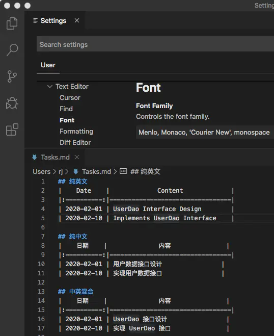
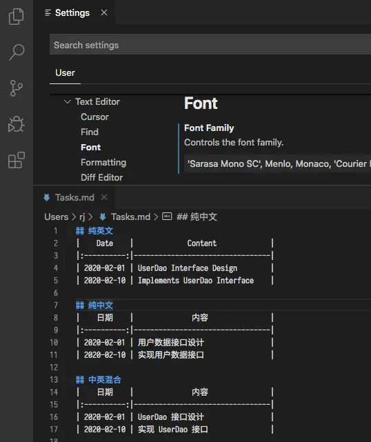
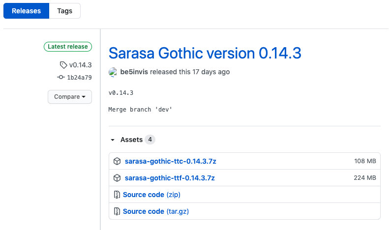

## VSCode 设置中英混合等宽字体  <!-- {docsify-ignore} -->

2020-10-20

在 VSCode 字体设置中，如果编辑的文档的内容为纯英文或纯中文，字体等宽效果是 OK 的。但如果文档是中英文混合的内容，使用系统自带的等宽字体，是无法达到统一的等宽效果的，一个中文字体的宽度并不恒等于两个英文字体的宽度。如下图所示中英文之间在纵向上是不对齐的：

如果将 VSCode 的首选字体修改为`等距更纱黑体 SC`（字体名称配置为 `'Sarasa Mono SC'`），就可以达到中英文混合都等宽的效果，如下图所示：

但是这个 `'Sarasa Mono SC'` 字体系统是默认没有的，需要自行下载安装，该字体为 `Github` 上的一个开源字体，打开该字体的发布页面 <https://github.com/be5invis/Sarasa-Gothic/releases>，选择最新版本下载安装即可。如当前（2020-10-21）最新版本为 `0.14.3`，如下图所示：

点击图中的 [sarasa-gothic-ttc-0.14.3.7z (108 MB)](https://github.com/be5invis/Sarasa-Gothic/releases/download/v0.14.3/sarasa-gothic-ttc-0.14.3.7z) 或 [sarasa-gothic-ttf-0.14.3.7z (224 MB)](https://github.com/be5invis/Sarasa-Gothic/releases/download/v0.14.3/sarasa-gothic-ttf-0.14.3.7z) 下载任一个即可，下载解压后，只需安装 `sarasa-gothic-ttc-0.14.3.7z` 里面的 `sarasa-regular.ttc` 或安装 `sarasa-gothic-ttf-0.14.3.7z` 里面的 `sarasa-mono-sc-regular.ttf` 即可。