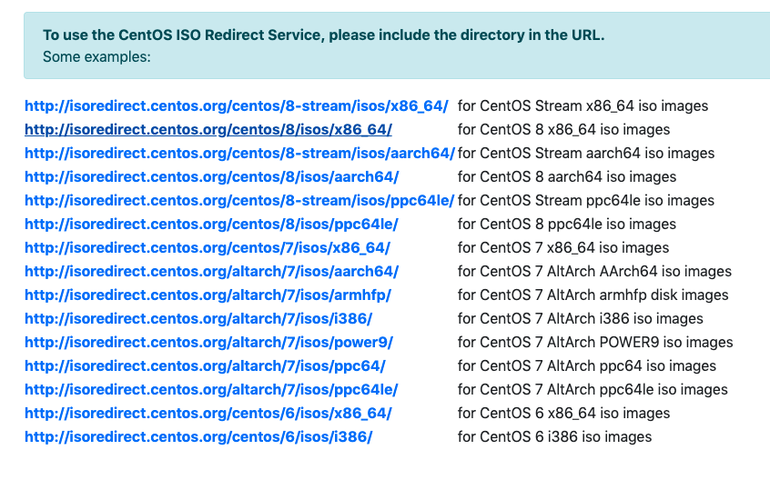
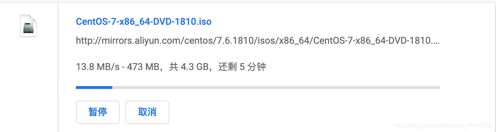
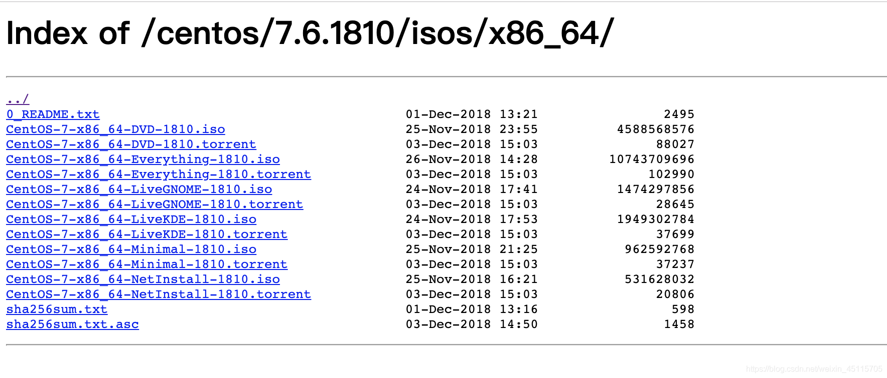

## CentOS 7镜像下载 以及 DVD ISO 和 Minimal ISO 等各版本的区别介绍 <!-- {docsify-ignore} -->

### 官网下载（速度慢）

官网下载地址：[官网下载链接](http://isoredirect.centos.org/centos/)
点击进入下载页面，随便选择一个下载即可（不推荐，推荐阿里云下载，见下文）

### 阿里云下载站点（推荐）

阿里云下载链接： <http://mirrors.aliyun.com/centos/>

进入国内的阿里云的，这里CentOS 7提供了三种ISO镜像文件的下载：`DVD ISO`、`Everything ISO`、`Minimal ISO`。

### 各个版本的ISO镜像文件的区别

`CentOS-7-x86_64-DVD-1810.iso` 标准安装版，一般下载这个就可以了（推荐）

`CentOS-7-x86_64-NetInstall-1810.iso` 网络安装镜像

`CentOS-7-x86_64-Everything-1810.iso` 对完整版安装盘的软件进行补充，集成所有软件

`CentOS-7-x86_64-LiveGNOME-1810.iso` GNOME桌面版

`CentOS-7-x86_64-LiveKDE-1810.iso` KDE桌面版

`CentOS-7-x86_64-Minimal-1810.iso` 精简版，自带的软件最少

根据需求来选择对应的镜像安装即可（安装下一步下一步即可）